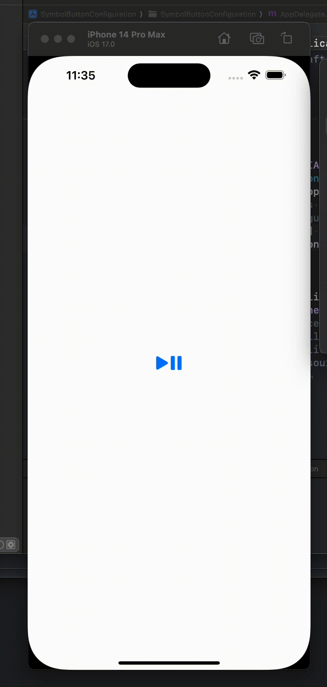

# SymbolButtonConfiguration

Use iOS 17 UIImageView Symbol Effects, Transitions with UIButtonConfiguration.

Tested with iOS 17.0 beta 2 SDK.



## Usage

**Swift is not supported.** There is a lack of functionality in the iOS 17 SDK. I believe Apple should improve the `_ObjectiveCBridgeable` compatibility between `SymbolEffect` and `NSSymbolEffect`.

It only supports Objective-C with MRC, but making it compatible with ARC is easy.

### Effect

```objc
SymbolButtonConfiguration *configuration = [SymbolButtonConfiguration plainButtonConfiguration];

configuration.image = [UIImage systemImageNamed:@"playpause.fill"];

SymbolButtonConfigurationEffect *effect = [[SymbolButtonConfigurationEffect alloc] initWithSymbolEffect:[NSSymbolBounceEffect bounceUpEffect]
                                                                                                options:[NSSymbolEffectOptions optionsWithRepeating]
                                                                                               animated:YES
                                                                                             completion:nil];

// You can add mutltiple effects.
[configuration.sbc_effects addObject:effect];
[effect release];

button.configuration = configuration;
```

### Transition

```objc
SymbolButtonConfiguration *configuration = [SymbolButtonConfiguration plainButtonConfiguration];

NSSymbolContentTransition *transition = [NSSymbolReplaceContentTransition replaceDownUpTransition];
NSSymbolEffectOptions *options = [NSSymbolEffectOptions optionsWithNonRepeating];
UIImage *image = [UIImage systemImageNamed:@"play.fill"];

configuration.image = image;

SymbolButtonConfigurationTransition *sbc_transition = [[SymbolButtonConfigurationTransition alloc] initWithSymbolImage:image transition:transition options:options completion:nil];
configuration.sbc_transition = sbc_transition;
[sbc_transition release];

button.configuration = configuration;
```
